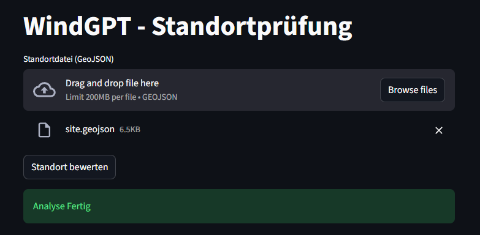
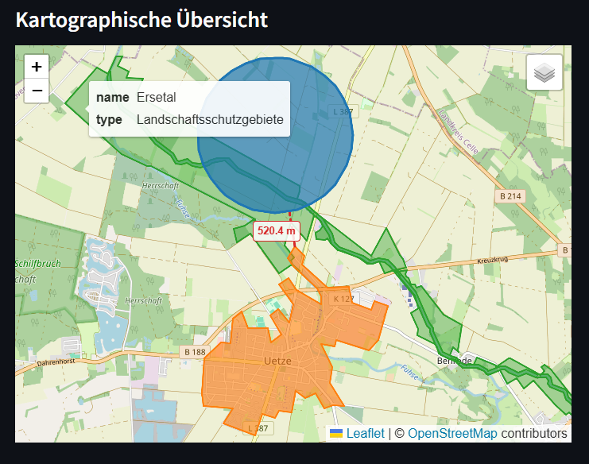
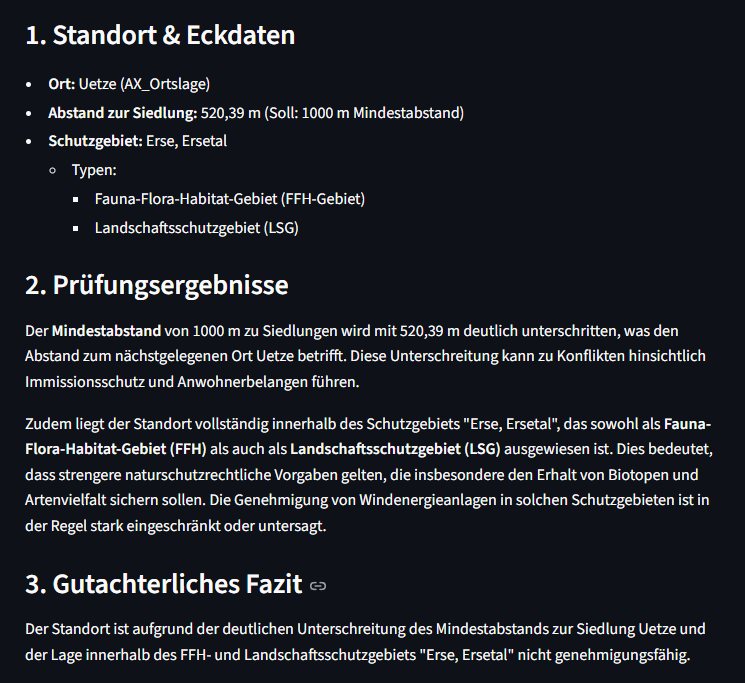
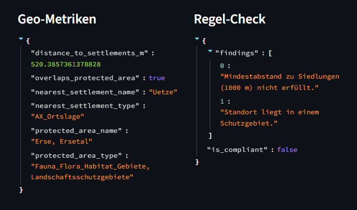

# 🛰️ WindGPT
> **Automated Site Assessment & Constraint Analysis.**
> Rapidly evaluates location feasibility by combining geospatial processing with AI-generated reporting.


---






---

## ⚡ Overview

**WindGPT** is a Python-based tool designed to automate the initial "sanity check" for potential wind farm locations in Germany.

The tool processes a target location (GeoJSON) through a three-step pipeline:

1. **Settlement Proximity (DLM250):**  
   Calculates distances to nearby buildings to verify regional buffer zones (e.g., 1000m rules).

2. **Environmental Constraints (BfN):**  
   Detects intersections with official protected areas to identify zoning risks immediately.

3. **AI Assessment:**  
   Synthesizes these spatial findings via the ChatGPT API into a structured architectural feasibility report.

> **Note:** WindGPT is a learning project. Because it uses the heavily generalized DLM250 dataset (scale 1:250,000), it cannot accurately identify individual buildings or isolated farms. It serves as a structural proof-of-concept for spatial analysis.

## 🚀 Getting Started

Follow these steps to set up the project locally. This project uses [Poetry](https://python-poetry.org/) for dependency management.

### 1. Prerequisites
* **Python 3.11+**
* **Poetry** installed (`pip install poetry`)
* **OpenAI API Key**

### 2. Installation
Clone the repository and install the dependencies:

```bash
git clone https://github.com/randomdiamond/WindGPT.git
cd WindGPT

# Install dependencies via Poetry
poetry install
```

### 3. Environment Setup
Create a `.env` file in the root directory to store your API keys securely:

```bash
# .env
OPENAI_API_KEY="your-openai-api-key"
```

### 4. Data Preparation
Before running the application, you must fetch and process the required spatial datasets (DLM250 and BfN Protected Areas). Run the preprocessing script from the root directory:

```bash
# Run the data pipeline to generate the .gpkg files
poetry run python scripts/preprocess_all_data.py
```
*Note: This will create `protected_areas.gpkg` and `settlements.gpkg` inside the `data/processed/` directory.*

### 5. Running the Application

This project features both a FastAPI backend and a Streamlit frontend demo.

**Start the Backend (FastAPI)** In your terminal, start the API server:
```bash
poetry run uvicorn app.main:app --reload
```
*(The API will be available at `http://localhost:8000` and docs at `http://localhost:8000/docs`)*

**Start the Frontend (Streamlit)** Open a **new** terminal window and run the Streamlit app:
```bash
poetry run streamlit run app/frontend_demo.py
```
*(The UI will automatically open in your browser at `http://localhost:8501`)*


## Attribution & Licenses

This project utilizes open government data. Per the requirements of the **Data License Germany – Attribution – Version 2.0**, please note the following sources and modifications:

**1. Settlement Data (DLM250)**
* **Source:** © GeoBasis-DE / [BKG](https://www.bkg.bund.de) (2026) [dl-de/by-2-0](https://www.govdata.de/dl-de/by-2-0)
* **Dataset:** Digitales Landschaftsmodell 1:250.000 (DLM250) via WFS (`https://sgx.geodatenzentrum.de/wfs_dlm250`)
* **Modification Note:** The original data has been modified by this project (filtered by specific object types, reprojected to EPSG:25832, standardized, and converted to GeoPackage format).

**2. Protected Areas (Schutzgebiete)**
* **Source:** © Bundesamt für Naturschutz (BfN) (2026) [dl-de/by-2-0](https://www.govdata.de/dl-de/by-2-0)
* **Dataset:** Schutzgebiete via WFS (`https://geodienste.bfn.de/ogc/wfs/schutzgebiet`)
* **Modification Note:** The original data has been modified by this project (filtered by specific protection zones, reprojected to EPSG:25832, standardized, and converted to GeoPackage format).